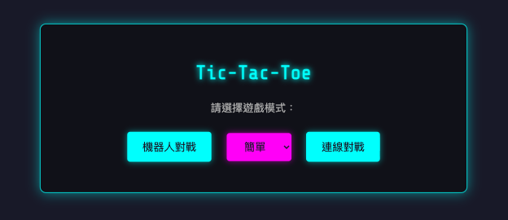
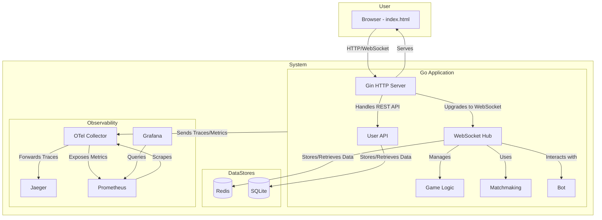

# Tic-Tac-Toe

<!--ts-->
- [Features](#features)
- [System Design](#system-design)
    - [Architecture Diagram](#architecture-diagram)
- [Getting Started](#getting-started)
- [Monitoring and Observability](#monitoring-and-observability)

<!--te-->

\
A real-time, web-based Tic-Tac-Toe game built with Go and WebSocket. It features player-vs-player and player-vs-bot modes, matchmaking, and a comprehensive observability stack.

## Features

- Real-time multiplayer gameplay using WebSockets.
- Player vs. Player (PvP) and Player vs. Bot (PvE) modes.
- Bot with multiple difficulty levels (Easy, Medium, Hard).
- Matchmaking system for PvP games.
- User authentication (Register, Login, Guest).
- Rematch mechanism, allowing new games within the same room.
- Automatic proxy actions on timeout for inactive players.
- Heartbeat mechanism to detect and manage player disconnections.
- Reconnection mechanism, enabling players to rejoin their game in the same room after an accidental disconnection.
- Support for auto-scaling and hot updates for high availability.
- Comprehensive observability with OpenTelemetry, Jaeger (tracing), Prometheus (metrics), Loki (logs) and Grafana (dashboards).
- Easy to run and deploy with Docker.
- Robust unit testing for core logic and components.

## System Design

The application features a scalable backend service with a clear separation of concerns. While the core game logic resides in a Go application, the use of Redis for managing player sessions and game states enables horizontal scaling of application instances. A central hub manages WebSocket connections, player matchmaking, and game state transitions.

- **Backend**: A Go application using the Gin framework for HTTP endpoints and Gorilla WebSocket for real-time communication.
- **Frontend**: A single `index.html` file with vanilla JavaScript that communicates with the backend via WebSockets.
- **Data Storage**:
    - **Redis**: Used for managing player sessions, matchmaking queues, and caching game state.
    - **SQLite**: Used for user account persistence (registration/login).
- **Observability**: The system is fully instrumented with OpenTelemetry.
    - **Jaeger**: Collects and visualizes traces.
    - **Prometheus**: Scrapes and stores metrics.
    - **Grafana**: Provides dashboards for visualizing metrics.

### Architecture Diagram



## Getting Started

The project is containerized and can be easily run using Docker Compose.

### Prerequisites

- Docker
- Docker Compose

### Running the Application

1.  **Clone the repository:**
    ```bash
    git clone https://github.com/ctchen222/Tic-Tac-Toe.git
    cd Tic-Tac-Toe
    ```

2.  **Run the application:**
    ```bash
    docker-compose up --build
    ```

3.  **Access the application and services:**
    - **Game**: `http://localhost:8080`
    - **Grafana**: `http://localhost:3000` (user: `admin`, pass: `admin`)
    - **Prometheus**: `http://localhost:9090`
    - **Jaeger UI**: `http://localhost:16686`

## API & WebSocket Events

### REST API

The server exposes a few REST endpoints under the `/api` path for user management.

- `POST /api/register`: Register a new user.
- `POST /api/login`: Log in an existing user.
- `POST /api/guest-login`: Log in as a guest.

### WebSocket Communication

The primary game interaction happens over a WebSocket connection established at `ws://localhost:8080/api/ws`.

**Connection Parameters:**

- `mode`: `human` or `bot`.
- `difficulty`: `easy`, `medium`, or `hard` (for `bot` mode).
- `playerId`: Optional player identifier.

**Client-to-Server Messages (JSON):**

- `{ "type": "move", "position": [row, col] }`: Make a move on the board.
- `{ "type": "rematch", "accept": true/false }`: Vote for a rematch.

**Server-to-Client Messages (JSON):**

- `{ "type": "assignment", "mark": "X" or "O" }`: Assigns the player's mark.
- `{ "type": "update", "board": [...], "next": "X" or "O", ... }`: Full game state update.
- `{ "type": "error", "message": "..." }`: Reports an error.
- `{ "type": "rematch_request" }`: Informs the player that the opponent wants a rematch.
- `{ "type": "rematch_successful" }`: Confirms that a rematch is starting.

## Monitoring and Observability

The `docker-compose.yml` file sets up a complete monitoring stack.

- **Jaeger**: For distributed tracing. View traces at `http://localhost:16686`.
- **Prometheus**: For metrics collection. Explore metrics at `http://localhost:9090`. The Go application and the OTel collector expose metrics endpoints.
- **Grafana**: For creating dashboards from Prometheus data. Access it at `http://localhost:3000`. A Prometheus data source is pre-configured.
- **Loki**: For log aggregation. Logs from the Go application are sent to Loki, which can be queried via Grafana.
